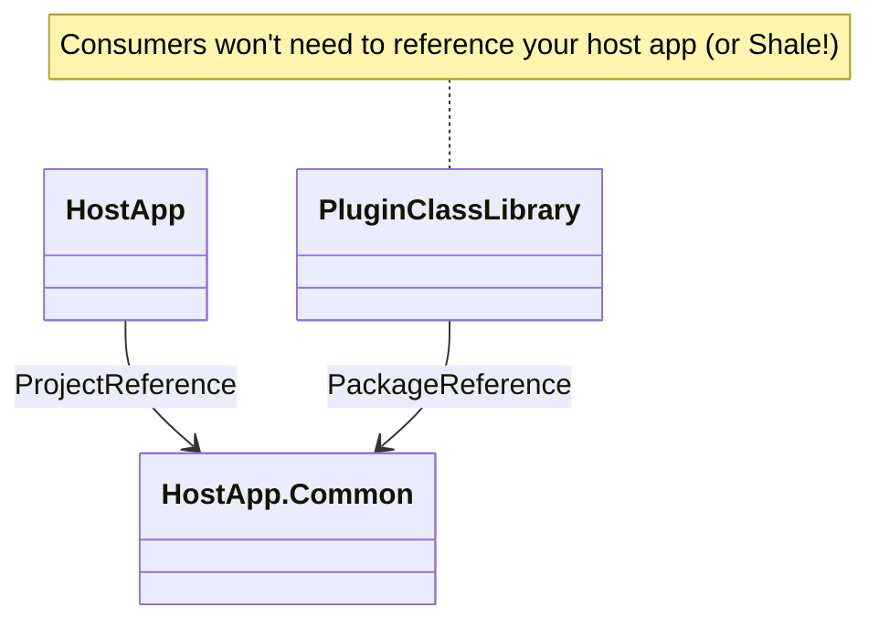
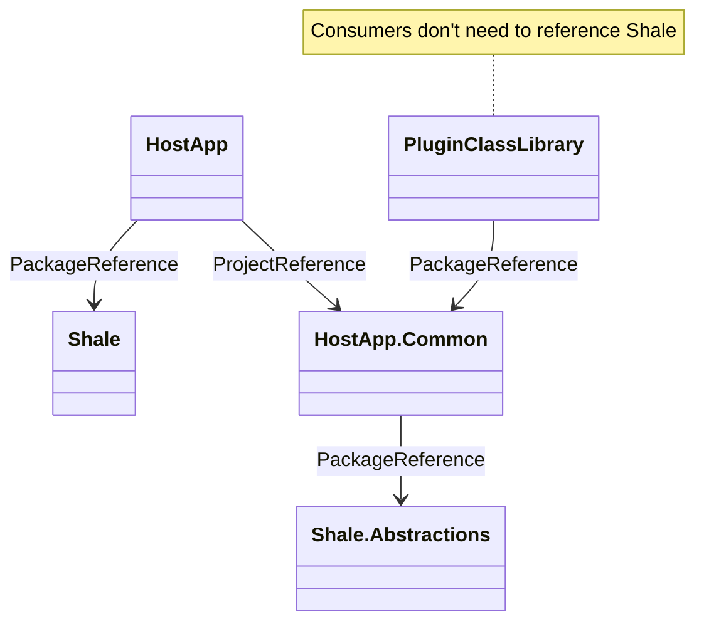

---
weight: 200
title: "Walkthrough"
description: "Detailed walkthrough of using Shale to load plugins in your app"
icon: "developer_guide"
date: "2024-03-04T02:17:43+10:00"
lastmod: "2024-03-04T02:17:43+10:00"
draft: false
toc: true
---

To properly demonstrate the capabilities of Shale, we'll do a start-to-finish walkthrough of adding plugin support 
to a .NET application using Shale. So if this seems daunting, just remember you might not need all of these steps, 
but if you're new to supporting plugins in your apps, you might find my method useful.

If you're going to be distributing an app (let's call it `HostApp`) and want consumers to be able to install plugins
built by someone other than yourself, you're going to want to make it easy to both **build** and **use** plugins.
This is going to require a little extra up-front work but I promise it will be pretty intuitive once you try it out.

## Prepare your projects

For example, let's imagine you have a .NET app called `HostApp` that we want to load plugins into. For this guide, we'll use a console app, but it could be almost any .NET app type. 

When we publish our app, we wouldn't want every plugin to have to reference our console app directly, since that would make building plugins way more cumbersome than necessary. Instead, we could split out the parts that our plugin authors would need into a `HostApp.Common` library. Doing that also means we could bring in Shale pretty easily without requiring plugin authors to bring too much into their projects.





### Install the package(s)

Shale is provided as two packages to minimise the dependencies needed for your app's plugin authors: `Shale` and `Shale.Abstractions`. Like the `Microsoft.Extensions.*` packages, the `.Abstractions` package contains only the required interfaces (`IPlugin` in this case) and references to the dependent interfaces (like `IServiceCollection` and `IConfiguration`).



So, to use this with our example project set up:

- We would install `Shale.Abstractions` into our `HostApp.Common` project
  - Since this is the one plugin authors will be building with, and they need the interfaces etc
- We would install `Shale` into our `HostApp` project
  - Since the `HostApp` will be responsible for actually loading the plugins, resolving from DI, etc

If you prefer a visual diagram, check out below, but if that seems daunting, don't be scared, it's not really that complicated.




## Sample Plugin Functionality

So let's use the classic "Hello, World" example for our app, but offload the actual "Hello" part to plugins! So in our `HostApp.Common` library, let's add an `IGreeter` interface:

```csharp
public interface IGreeter {
	string Greet(string name);
}
```
We'll loop back to using this interface later on.

## Loading Plugins

Assuming your .NET app uses the `Microsoft.Extensions.DependencyInjection` APIs, you likely already have an `IServicesCollection` object in your startup, but if you don't already, you'll need to create one.

For example, if I'm putting together a command-line app using [`Spectre.Console.Cli`](https://spectreconsole.net/cli/), I can add DI using the [`Spectre.Console.Cli.Extensions.DependencyInjection`](https://github.com/WCOMAB/Spectre.Console.Cli.Extensions.DependencyInjection) package with code like below:

```csharp
var services = new Microsoft.Extensions.DependencyInjection.ServiceCollection();
var app = new CommandApp(new Spectre.Console.Cli.Extensions.DependencyInjection.DependencyInjectionRegistrar(services));
app.Configure(c => {
	c.SetApplicationName("Sample Host App");
	c.AddCommand<GreetingCommand>("greet");
});
return app.Run(args);
```

From there, we just need to add one line to start loading plugins using the default conventions:

```csharp
var services = new Microsoft.Extensions.DependencyInjection.ServiceCollection();
services.AddPlugins(); // <-- This is where Shale comes in
var app = new CommandApp(new Spectre.Console.Cli.Extensions.DependencyInjection.DependencyInjectionRegistrar(services));
app.Configure(c => {
	c.SetApplicationName("Sample Host App");
	c.AddCommand<GreetingCommand>("greet");
});
return app.Run(args);
```

### Default conventions

This is where the "opinionated" part of the tagline comes into play. By default, this will look for directories in both the "./Plugins" directory relative to the current directory, and the "./Plugins" directory relative to the current executable.

Shale will attempt to load any directories in those directories that have a `.dll` file in them. For example:

```text
│   HostApp.exe
└───Plugins
	└───Plugin1
	│	│   // trimmed for brevity
	│	│   HostApp.Common.dll
	│	│   Plugin1.dll
	│	└───Plugin1.deps.json
    └───Plugin2
		│   // trimmed for brevity
		│   HostApp.Common.dll
		│   Plugin2.dll
		└───Plugin2.deps.json
```

When your app calls Shale, it will attempt to load two plugins: "Plugin1" from `Plugin1.dll` and "Plugin2" from `Plugin2.dll`.



Now, at the moment, that's not very helpful because any plugins it finds there won't actually *do* anything. We can fix that though, so let's keep going...

## Configure plugins

Currently, Shale will discover and load any plugin assemblies in the default search paths, but the plugins are completely isolated, and we're not actually using anything from those plugins yet.

There's two ways of handling this, depending on how complex you want your plugins to be. You can mix-and-match both methods, but we'll start with the "simpler" method.

### Directly load types

So we know that we want to load an `IGreeter` implementation (from [above](#sample-plugin-functionality)) from a plugin, so let's show how to just quickly pull any `IGreeter` implementations out of any plugins we find. Just update the call to `AddPlugins` using the fluent API:

```csharp
services.AddPlugins<IPlugin>(c => c.AlwaysLoad<IGreeter>());
```

This tells Shale you want to always load **_any_** `IGreeter` implementation from any plugins it discovers. Any time it finds a type that can be assigned to `IGreeter` it will add it to the DI container as an implementation of `IGreeter`. 

Using this method, plugins don't even need to include any additional code, attributes, or markers.

### Using a plugin type

Alternatively, plugin authors can implement a specific interface to get a bit more control over how their plugins are loaded.

Shale includes an `IPlugin` interface that you can use out of the box if you don't have any domain-specific logic to add. Alternatively, if you have extra requirements, or just want to keep Shale abstracted away for authors, you can use your own plugin type inheriting from `IPlugin`.

```csharp
public interface IAppPlugin : IPlugin {}
```

```csharp
services.AddPlugins<IAppPlugin>();
```

Whether you use your own `IPlugin` implementation or Shale's, the plugin interface includes one method: `ConfigureServices(IServiceCollection services, IConfiguration? config = null)`. Plugins can use this method to register services with the DI container, but we'll get into more detail about that [in a bit](#replacing-host-services-from-your-plugins).

When Shale finds an implementation of the plugin type specified in the call to `AddPlugins` (or `IPlugin` if you don't specify your own type), Shale will automatically load that type from the plugin assembly and (near the end of the loading process) automatically call the `ConfigureServices` method for each plugin.



#### Type sharing

Now this is going to get a bit confusing but, in my experience, you might never need to cover it. By default, when plugins are loaded (by `DotNetCorePlugins`), they are loaded into their own isolated "context" which means types are not shared from the host to the plugin or vice-versa.

Shale, by default, slightly tweaks this by sharing some types with plugins: `IServiceCollection`, `ILogger`, `IConfiguration` and any types you specify with `AlwaysLoad`. If, however, you want your plugins to share (in either direction) any other types with the host, you can add them with the fluent API:

```csharp
services.AddPlugins<IAppPlugin>(c => c.ShareTypes(typeof(GlobalOptions)));
```

or enable type sharing for all types with:

```csharp
services.AddPlugins<IAppPlugin>(c => c.ShareAllTypes());
```

> You can find more information on what type sharing is and when you might need it in [this excellent explainer](https://github.com/natemcmaster/DotNetCorePlugins/blob/main/docs/what-are-shared-types.md) from the `DotNetCorePlugins` project itself.

## Using plugins from your host

At this point, we have our host app (`HostApp`) loading any plugins it finds in the `Plugins` directory, automatically registering any `IGreeter` implementations it finds. Now that we've done that, let's actually use our plugins.

To get a greeter (from your plugins), just resolve the service from the DI container like usual:

```csharp
// to get the last registered implementation
var greeter = services.BuildServiceProvider().GetService<IGreeter>();
// or all of them at once
var greeters = services.BuildServiceProvider().GetServices<IGreeter>();
```

Since we're just using the standard Microsoft DI container logic, you can even use features like constructor injection if your app environment supports it.

## Replacing host services from your plugins

If your plugins are using [plugin types](#using-a-plugin-type), plugins can also "override" services from the host with their own implementation. Then, in your host, when you resolve a service from the DI container, you'll get the plugin's implementation of that service.

```csharp
public class OutputWriterPlugin : IAppPlugin {
	public IServiceCollection ConfigureServices(IServiceCollection services, IConfiguration? config) {
		services.AddSingleton<IOutputWriter, CustomConsoleWriter>();
		return services;
	}
}
```

## Customizing plugin loading

We've seen what the Shale API looks like for tweaking how plugins are loaded and used in your app, but it's also very easy to customize where Shale finds your plugins.

The easiest way is to add new paths to Shale's "search paths". These are paths that Shale then looks through (using the usual one-folder-per-plugin method) for plugins to load. You can easily add paths using the `AddSearchPath` fluent API:

```csharp
var modulesPath = Path.Join(Environment.CurrentDirectory, "Modules");
services.AddPlugins<IAppPlugin>(c => c.AddSearchPath(modulesPath));
```

This will add a new path that Shale will search using the [default conventions](#default-conventions) to find plugins.





## Checkpoint

At this point if you've followed along, we have a host app (`HostApp`) that's set up to load any plugins from a _Plugins/_ directory, register any `IGreeter` implementations and let those plugins register their own services (in an `IAppPlugin` implementation).

This only takes a couple of lines of code in your app, then Shale will do the discovery and configuration, handing off to `DotNetCorePlugins` for the actual plugin loading.

Next, we're going to look at how to actually author a plugin that our app can load!

## Creating a plugin

To create a plugin (`PluginClassLibrary` from the diagrams in [our example projects](#prepare-your-projects)), we just need to follow a few steps:

- Create a new class library
- Reference our Common/Abstractions/etc library
- Add our implementations
- Copy/publish it to the right place

### Create a new class library

This should be pretty straightforward most of the time. For example:

```powershell
dotnet new classlib
```

### Add References

If you're creating a plugin inside your own solution and/or codebase, you can just add a reference to the project that includes the interfaces plugins will need access to (`HostApp.Common` in our examples):

```powershell
dotnet add reference ../HostApp.Common/HostApp.Common.csproj
```

But if you want authors to be able to create and distribute plugins from outside your own codebase, you might want to publish a NuGet package with the abstractions that plugins need to use. This is where splitting out abstractions into their own project can help ([as discussed here](#prepare-your-projects)). If you've done that, authors should instead install your package:

```powershell
# This is an example only!
dotnet add package HostApp.Common
```

### Add our implementations

In this example, that starts with an implementation of `IGreeter`:

```csharp
public class Greeter(GlobalOptions options, IOutputWriter writer) : IGreeter {
	public string Greet(string name) {
		if (options.Verbose) { //the plugin doesn't need to know where this value is coming from!
			writer.Write("You are running in verbose mode!"); 
		}
		return $"Hello {name} from an external plugin!";
	}
}
```

If we want our plugin to do anything else, we could use a [plugin type](#using-a-plugin-type) to register some services:

```csharp
// we're not including the implementation of `PrefixedConsoleWriter` here, but you get the idea!
public class OutputWriterPlugin : IAppPlugin {
	public IServiceCollection ConfigureServices(IServiceCollection services, IConfiguration? config) {
		services.AddSingleton<IOutputWriter, PrefixedConsoleWriter>();
		return services;
	}
}
```

At this point, that's all the code we need: we've added an `IGreeter` implementation and we've even added our optional plugin type.

### Build and copy the plugin

Now we just need to build the plugin into a directory we can drop into our _Plugins/_ directory. For example, from our plugin class library folder:

```powershell
dotnet build -o PluginClassLibrary/
```



You should then end up with a directory called `PluginClassLibrary` with our compiled plugin in it. Once you've built or published your `HostApp`, just open the folder (wherever the executable ends up), create a folder named "Plugins" and copy your newly created "PluginClassLibrary" folder into it. The next time you run `HostApp.exe`/`HostApp`, it will automatically discover and load the services from your plugin at startup!

## Wrap-up

That's it! Now that might have seemed like a lot, but we've gone into quite a bit of detail here. There's not actually that much to it!

Set up your projects, add the Shale packages as necessary, set up your DI container, add your call to `AddPlugins` and put your compiled plugins in the "Plugins" directory. 

### Sample

Now if you made it this far, here's a bonus: there's an entire sample project recreating this whole walkthrough!

If you check the `samples` directory of [the repository](https://github.com/agc93/shale), you'll find a sample project of both the host app (in the `host` folder) and a simple plugin (in the `plugin` folder). This is a complete ready-to-run sample!

You can run the host app using `dotnet run` (or from your IDE) to see how it works without any plugins, then jump over to the `plugin/` folder, and build in Release mode (i.e. `dotnet build -c Release`) to build the plugin straight into the right folder for the host app to find. Run the host app again and you'll see it load the plugin and how the behaviour changes.

The sample app uses Spectre.Console.Cli, Spectre.Console.Cli.Extensions.DependencyInjection and Shale to demonstrate loading plugins for a simple CLI application.